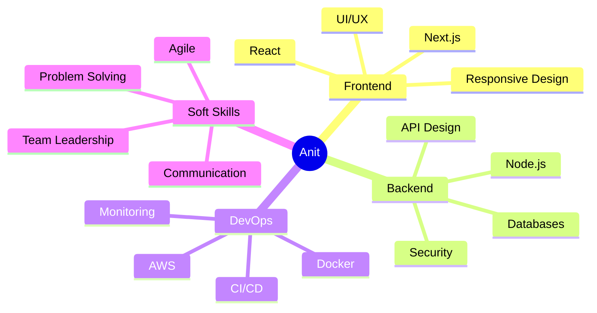

# 
Hi there!  I'm Anit

  

  

## 
🚀 About Me

  
  🎓 I'm a **Full Stack Developer** passionate about building digital experiences
  
  🌱 Currently exploring the realms of **Cloud Architecture** and **System Design**
  
  💡 I love contributing to **Open Source Projects**
  
  ⚡ Fun fact: I can debug code faster than I can find my keys 🔑

### 
⚒️ My Development Arsenal

  
| 🎯 Frontend Mastery | 💻 Backend Expertise | 🛠 Development Tools |
|:------------------:|:-------------------:|:-------------------:|
| React.js | Node.js | Git & GitHub |
| Next.js | Express.js | Docker |
| TypeScript | MongoDB | VS Code |
| TailwindCSS | PostgreSQL | Postman |
| Redux | REST APIs | AWS |

### 
🎯 Current Focus

  
  
  

### 
⚡ Core Skills

  

## 🛠️ Tech Stack

  

## 📊 GitHub Stats

  
  

## 🏆 GitHub Trophies

  

## 🤝 Connect With Me

  

## 📈 Activity Graph

---

  <picture>
    <source media="(prefers-color-scheme: dark)" srcset="https://raw.githubusercontent.com/anitcodes/anitcodes/output/github-contribution-grid-snake-dark.svg">
    <source media="(prefers-color-scheme: light)" srcset="https://raw.githubusercontent.com/anitcodes/anitcodes/output/github-contribution-grid-snake.svg">
    
  </picture>

