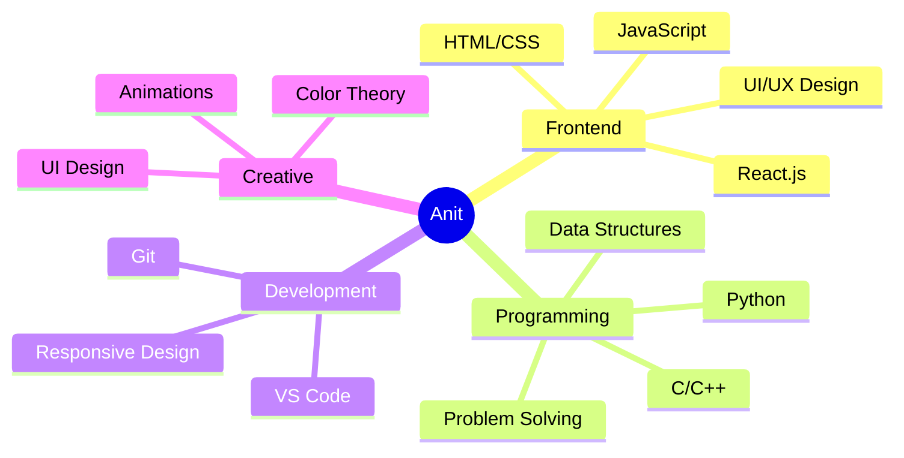

# 
Hi there!  I'm Anit

  

  

## 
🚀 About Me

  
  🎨 I'm a **Frontend Developer** who loves creating beautiful user interfaces
  
  💻 Proficient in **C/C++** and **Python** for problem solving
  
  ⚛️ Currently mastering **React.js** and its ecosystem
  
  🎯 Focused on creating responsive and interactive web experiences
  
  ⚡ Fun fact: I turn caffeine into code and bugs into features! ☕

### 
⚒️ My Tech Stack

  
| 🎯 Frontend Development | 💻 Programming Languages | 🛠 Tools & Technologies |
|:------------------:|:-------------------:|:-------------------:|
| React.js | C/C++ | Git & GitHub |
| HTML5/CSS3 | Python | VS Code |
| JavaScript | - | Chrome DevTools |
| Bootstrap | - | npm |
| Canva | - | Figma |

### 
🎯 Current Focus

  
  
  

### 
⚡ Core Skills

  

## 🛠️ Tech Stack

  

## 📊 GitHub Stats

  
  

## 🏆 GitHub Trophies

  

## 🤝 Connect With Me

  

## 📈 Activity Graph

---
### 
Made with ❤️ by Anit

